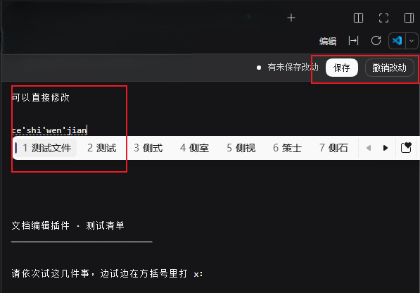
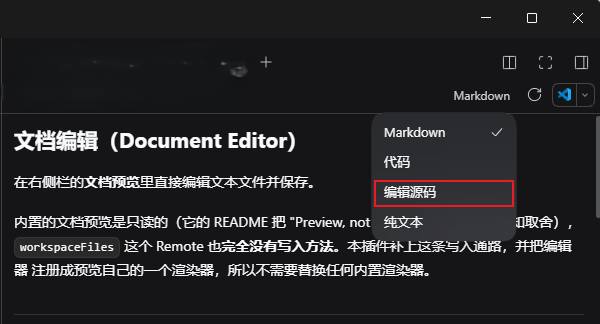

# 文档编辑（Document Editor）

在右侧栏的**文档预览**里直接编辑文本文件并保存。

内置的文档预览是只读的（它的 README 把 "Preview, not editing" 写成明确的已知取舍），
`workspaceFiles` 这个 Remote 也**完全没有写入方法**。本插件补上这条写入通路，并把编辑器
注册成预览自己的一个渲染器，所以不需要替换任何内置渲染器。

---

## English

**Edit text documents in place in the DSH Sidebar document preview.**

DSH's shipped document preview is read-only by design — its own README lists *"Preview, not editing"* as a deliberate limitation — and the workspace-files Remote exposes no mutation operation at all. This plugin adds that missing write path and registers the editor as one of the preview's own renderers, so no built-in renderer is replaced.

**Install** — ask your DSH agent, then reload the page once:

```
plugin_manager { action: "install_bundle", target: "github:hh719509125/deepseek_harness_plugin#path:/document-editor" }
```

**Use**

1. **Open a file.** Press `Ctrl+P` in the right Sidebar to open the file tree and click a `.txt`, code or `.json` file — or open it from a file reference in the conversation, or from a delivered-file card.
2. **Type.** Files with those extensions open **as this editor** instead of the read-only preview.
3. **Save** with `Ctrl+S`, or the Save button on the toolbar.
4. To go back to the read-only view, choose **Plain text** in the renderer dropdown.

The toolbar shows the state at a glance:

| Indicator | Meaning |
|---|---|
| green dot · Saved | buffer matches disk |
| yellow dot · Unsaved changes | not written yet; closing the tab or the page warns first |
| Saving… | the write is in flight |

`Tab` indents two spaces. **`.md` keeps its rendered Markdown by default** — the editor is offered as *Edit source* in the renderer dropdown, so the preview is never taken away.

**Behaviour worth knowing**

| Situation | What happens |
|---|---|
| The file changed on disk before you save | A "changed on disk, nothing overwritten" prompt offers **Overwrite with mine** or **Discard mine and reload**. It never overwrites silently |
| The file changes while you are editing | A "load disk version" notice appears; your buffer is **never replaced behind your back** |
| The file was deleted | The save returns 404 and says so — it does **not** recreate the file |
| The file is larger than one preview page | Saving is **disabled** with an explanation: the preview reads one page at a time, so writing back would truncate the rest |
| The file is outside the session workspace | Readable, but the write is refused by the sandbox unless that session is `danger-full-access` |
| `.docx` / `.xlsx` / `.pptx` | Not applicable — those preview as converted PDF, and the browser has no editable document model |

**Compatibility.** Built and verified against DSH `0.2.0-rc.2`. It depends on two internal DSH contracts — Connection's exact `/api` Fetch route and the preview's `documentPreviews` renderer registry — which are not promised to be stable across release candidates. If the *Edit* renderer never appears, check the DSH version first.

The rest of this document is in Chinese and goes deeper: how the write path is authenticated, every configuration field, and implementation notes.

---

## 使用

还没装？见下面的[安装](#安装)。

装好、并**刷新一次页面**之后：

1. **打开文件。** 在右侧栏按 `Ctrl+P`（桌面默认快捷键，打开「文件」树），点一个 `.txt` / 代码 / `.json` / `.yaml` 文件；它会在右侧栏作为一个标签打开。从对话里的文件引用、或交付文件卡片点开也一样。
2. **直接改。** 这些后缀的文件打开时**就是这个编辑器**，不再是只读预览——光标点进去就能打字。
3. **保存。** 按 `Ctrl+S`，或点工具条上的「保存」。
4. **想切回只读预览**：用标签工具条上的渲染器下拉，选「纯文本」。



上图就是编辑中的样子。注意三点：

- 第二行的窄工具条是本插件加的：**文件路径 · 状态点 · 保存 · 撤销改动**
- 状态点是**黄色**、写着「有未保存改动」——还没写盘
- 图里正在用输入法打字（可以看到候选词条），说明**中文输入法在编辑器里正常工作**

工具条上一眼能看到状态：

| 指示 | 含义 |
|---|---|
| 绿点 · 已保存 | 缓冲区与磁盘一致 |
| 黄点 · 有未保存改动 | 还没写盘；此时关标签或关页面会拦一下 |
| 保存中… | 正在写盘 |

还有几个顺手的：

- `Tab` 缩进两格（不跳出编辑区）
- 「撤销改动」把缓冲区退回磁盘上的版本
- 关标签/关页面时若有未保存改动会拦一下
- **`.md` 默认仍然是渲染好的 Markdown**，编辑器在下拉的「编辑源码」里——它不抢 Markdown 的默认位置



上图是 `.md` 文件的渲染器下拉：打勾的仍是 **Markdown**（默认），「编辑源码」是本插件新增的选项。
所以打开 `.md` 不会失去渲染视图，想改源码时从下拉里切过去即可。

### 各种情况下的表现

| 情况 | 表现 |
|---|---|
| 保存时文件已被别处改动 | 提示「文件已在磁盘上变化，未覆盖」，并给两个选择：**用我的覆盖** / **放弃我的改动并重新载入**。默认绝不覆盖 |
| 编辑期间磁盘上又变了 | 提示条出现「载入磁盘版本」，你的缓冲区**不会被自动替换** |
| 文件被删掉了 | 保存返回 404 并说明，**不会把文件重新创建出来** |
| 文件大过一页预览 | 保存**停用**并说明原因：预览是一次一页读的，回写会把后面的内容截断，所以宁可不让存 |
| 工作区**外**的文件 | 读得到，写会被沙箱拦下（除非该会话是 full-access） |
| `.docx` / `.xlsx` / `.pptx` | 不适用——预览是转 PDF，浏览器里没有可编辑文档模型 |

## 效果

- 打开 `.txt`、代码、`.json`、`.yaml` 等文本文件时，**默认就是这个编辑器**（原来的「纯文本」仍在下拉里可切回）
- 打开 `.md` 时**仍然渲染 Markdown**，下拉里多一项「编辑源码」
- 编辑器上方一条窄工具条：文件路径、保存状态、**保存**、**撤销改动**
- **Ctrl+S** 保存；有未保存改动时关页面会拦一下
- 冲突保护：保存时带上打开那一刻的文件版本，磁盘上变了就返回 409 提示，**不会静默覆盖**
- 行尾保留：CRLF 文件存回去仍是 CRLF，并补回结尾换行 —— 未改动的缓冲区保存后磁盘内容**逐字节不变**

## 安装

插件由 **agent** 安装（`plugin_manager` 是 agent 工具，用户不直接调用）。把这条**规格**发给你的 DSH agent：

```
plugin_manager { action: "install_bundle", target: "github:hh719509125/deepseek_harness_plugin#path:/document-editor" }
```

`#path:/document-editor` 是 pnpm 的 git 子目录规格，**不需要发布到 npm**，也不需要手动克隆。安装后会写进 profile 的 `package.json` 和 `dsh.profile.bundles` 并热应用。

- **权限**：`plugin_manager` 需要 `danger-full-access` 或当次批准。装进来的 Host 代码在工作区沙箱之外、以你的用户身份在本进程内执行，装之前请先读一遍 `index.js`。
- **刷新页面**：安装是热应用的，但浏览器侧需要刷新一次才能加载新的 client bundle。

想固定版本或离线时，改为克隆后按绝对路径安装：

```
git clone https://github.com/hh719509125/deepseek_harness_plugin.git
plugin_manager { action: "install_bundle", target: "<克隆路径>/document-editor" }
```

> ⚠️ 路径装法下 profile 只记录路径、不复制文件，装好之后不要移动或删除那个目录。

## 兼容性

为 **DeepSeek Harness `0.2.0-rc.2`** 开发和验证。依赖两处 DSH 内部约定：Connection 的 `/api` 精确 Fetch 路由，以及预览的 `documentPreviews` 渲染器注册表。DSH 仍在 rc 阶段，这些**不承诺跨版本稳定**；装完看不到「编辑」渲染器就先确认 DSH 版本。

## 配置

都在 [cordis.patch.yml](cordis.patch.yml) 的 `document-editor` 那一行：

| 字段 | 默认 | 说明 |
|---|---|---|
| `extensions` | 65 个后缀 | 哪些后缀**默认**进编辑器。刻意不含 `md`/`html`/`svg`/`csv`/图片/PDF —— 它们各自有更好用的内置渲染器 |
| `markdown` | `true` | 是否为 `.md` 额外提供「编辑源码」渲染器（不改变 Markdown 仍是默认这一事实） |
| `maxBytes` | `8388608` | 单次保存的 UTF-8 字节上限，超过返回 413 |

Host 会把这份配置注入页面（`__DSH_DOC_EDITOR_CONFIG__`），改完刷新页面生效。

## 工作原理

写入不是走 Remote——`@deepseek-ai/dsh-api-remotes` 把 Client 的 `ctx.remote` 命名空间
**固定在构建期**，插件加不了新命名空间。所以插件改为在 Connection 的 `/api` 桥上**认领一条
exact Fetch 路由**：

```
ctx.connection.fetch.register({ path: '/api/dsh-doc-editor', methods: ['POST'], ... })
```

Connection 自己持有 `/api` 前缀路由，先跑信任闸（loopback/Origin，失败 403）和浏览器
session cookie 鉴权（失败 401），再交给 shared fetch handler；handler **先查 exact 路由表**。
所以这条路由天然带着内置鉴权，插件一行信任检查都不用写。

写入落到 `ctx.fs.writeText`，并带上**该 Session 的 standing sandbox policy**——用和
`dsh-tool-fs` 完全一样的方式解析，所以就地保存受的约束和 agent 自己的 `write` 工具一致，
不会成为绕过文件沙箱的口子。

保存前会 `stat` 一次：**只保存已存在的文件**。目标不见了返回 404，而不是被
create-or-overwrite 语义重新创建出来。

## 边界

| 情况 | 行为 |
|---|---|
| 工作区内的文本文件 | ✅ 正常 |
| 工作区**外**的文件 | 读得到，**写被沙箱拦**（除非该 Session 是 full-access） |
| `.docx` / `.xlsx` / `.pptx` | ❌ 预览是转 PDF，浏览器里没有可编辑文档模型。要编辑得在 Host 用 python-docx/openpyxl 做结构化写回 |
| 单页读不完的大文件 | ⚠️ 保存**停用**并给出说明。`text-pages` 是一次一页读的，回写会把后面的内容截断，所以宁可不让存 |

## 开发

插件包里的 [cordis.patch.yml](cordis.patch.yml) **刻意不含任何本机路径**：bundle patch 会应用到每个安装它的 profile，一条绝对路径会跟着跑到别人机器上。热重载要写到**安装方的 profile 层**（`<DSH_HOME>/profiles/<profile>/cordis.patch.yml`，优先级高于所有 bundle 层）：

```yaml
- id: hmr
  name: '@deepseek-ai/dsh-hmr'
  config:
    root: ['.', '<本插件的绝对路径>']
```

配好后 `index.js`（Host 半边）改完**不重启就生效**；`client.js`（Client 半边）属于浏览器侧，改完刷新页面即可。

日常用 `cordis.patch.yml` 里的 `extensions` / `markdown` / `maxBytes` 就够了，不必改代码。

**改动怎么验。** 写入通路必须带鉴权地打真实路由，而 DSH 的 browser-session cookie 签名是
`dsh-client-connection` 的内部实现、并未承诺稳定，所以这里不附带测试。开发时用的是本机探针，
覆盖下面这些行为：

| 类别 | 覆盖 |
|---|---|
| 鉴权 | 带会话 cookie → 200；无 cookie → 401 |
| 写入 | 内容正确落盘；返回新 version |
| 行尾 | CRLF 文件存回仍是 CRLF 且补回结尾换行；LF 文件保持 LF |
| 幂等 | 未改动缓冲区保存后磁盘内容**逐字节不变** |
| 冲突 | 过期 version → 409 `FS_STALE_VERSION`，且文件原封不动 |
| 缺失目标 | → 404，且**不会被重新创建** |
| 坏请求 | 请求体不是合法 JSON/对象 → 400 |
| 投递 | 页面 boot 载荷列出 client bundle，且该 bundle 能构建、内容含渲染器注册 |

## 卸载

```
plugin_manager { action: "remove_bundle", target: "@local/dsh-plugin-document-editor" }
```
